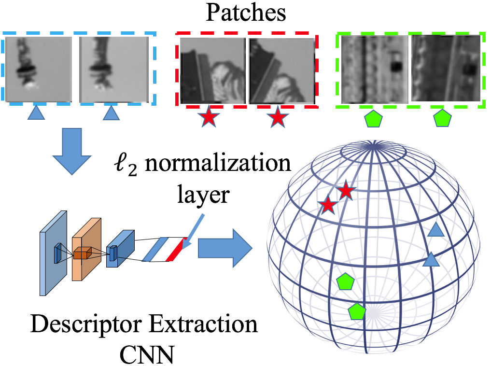
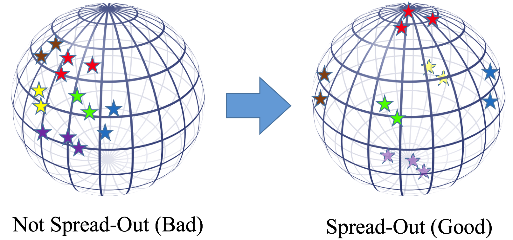

# Spread-out Local Feature Descriptor

###  We embeded our regularization with the state-of-the-art HardNet and achieved a much better result than the triplet net. Please find the new code  [here](https://github.com/ColumbiaDVMM/hardnet).

This code is the training and evaluation code for our ICCV 2017 paper ([arxiv](https://arxiv.org/abs/1708.06320)).

@inproceedings{zhang2017learningb, 
  title={Learning Spread-out Local Feature Descriptors}, 
  author={Zhang, Xu and Yu, Felix X. and Kumar, Sanjiv and Chang, Shih-Fu}, 
  booktitle={ICCV}, 
  year={2017} 
}

The code is tested on Ubuntu 16.04 with Nvidia GTX 1080 Ti.

## Introduction

Descriptor extraction is mapping an image patch to a point in the descriptor space.

To spread out all the points in the descriptor space helps us to fully utilize the descriptor space.

Since uniform distribution has nice 'spread-out' property, we learn a descriptor that has similar as uniform distribution on sphere.

We randomly sample non-matching patches from dataset and let the mean and second order moment of the cosine distance of the descriptors to be close to those of uniformly randomly sampled points on unit sphere (0 mean and 1/d second order moment).

### Requirement
Python package:

tensorflow>1.0.0, tqdm, cv2, skimage, glob

### Usage

#### Get the data

Download UBC patch dataset [1] from http://www.iis.ee.ic.ac.uk/~vbalnt/phototourism-patches/. We thank Vassileios Balntas for sharing the data with us. 

Extract the image data to somewhere. In the code the default location is /home/xuzhang/project/Medifor/code/Invariant-Descriptor/data/photoTour/. See batch_process.py for details.

#### Run the code

`cd ./tensorflow`

`python batch_process.py`

batch_process.py is the code for running the whole pipeline. Pls see the file for detailed information. For the detail of the parameter. 

`python patch_network_train_triplet.py`

All the result will be stored in the folder called `tensorflow_log`. Use Tensorbroad to see the result. 

`tensorboard --logdir=../tensorflow_log`

### Acknowledgement 

We would like to thank

TFeat [1] 

for offering the baseline implementation. 

and

UBC dataset [2]

for providing the image data.

[1] V. Balntas, E. Riba, D. Ponsa, and K. Mikolajczyk. Learning local feature descriptors with triplets and shallow convolutional neural networks. BMVC, 2016

[2] M. Brown, G. Hua, and S. Winder. Discriminative Learning of Local Image Descriptors. TPAMI, 2011

